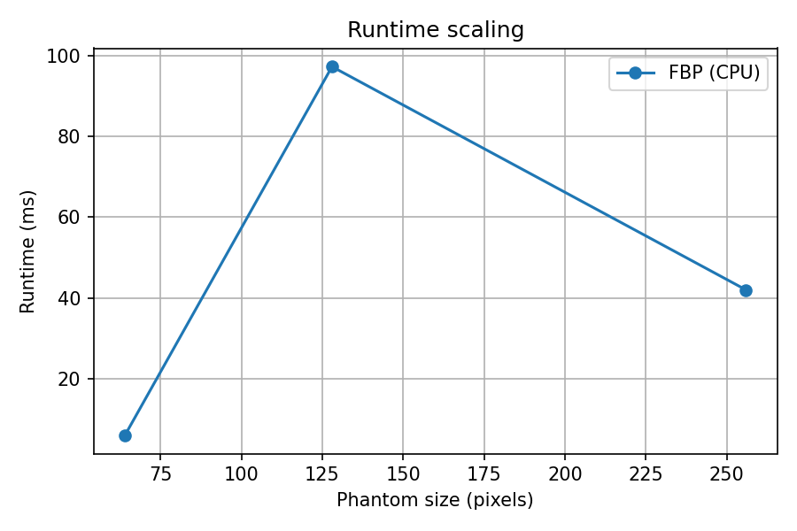

# RBYRCT-GTC-2025
# 🩻 RBYRCT: Reconstructing CT Smarter, Faster, Safer

Patent-pending (Ray-by-Ray Computed Tomography) **RBYRCT reconstruction technology** for next-gen CT — designed to accelerate the fight against breast cancer with GPU-optimized iterative reconstruction.

Breast cancer screening saves lives, but today’s CT scans require **high radiation doses** to get clear images. That dose can be risky, especially for younger patients. Our technology, **RBYRCT**, is designed to **cut radiation dose without losing detail** - potentially transforming how cancers are caught early.

Traditional breast cancer imaging techniques can often be uncomfortable, invasive, and anxiety-inducing, with lots of compression!

With Ray-by-Ray Computed Tomography (RBYRCT), we are creating a new gold standard in imaging that not only enhances diagnostic accuracy but also prioritizes the comfort and well-being of patients!

Higher accuracy in tumor detection: Earlier and more precise detection means better outcomes.
Reduced radiation exposure: Safer screening processes ensure minimal health risks.
No compression! Our patient-friendly design aims to minimize discomfort, making the imaging process less invasive and more manageable for women.
Empowering healthcare choices: By providing more reliable imaging results, we empower women to take proactive steps in their healthcare journeys.

We eventually want to reshape the entire cancer detection experience!

Published! Learn more about our work here. https://www.joaiar.org/articles/AIR-1012.pdf

Hi, I’m Syed Hussain Ather—a scientist, innovator, and the driving force behind Janus Sphere Innovations, a groundbreaking company poised to transform cancer detection and imaging. Over the past year, I’ve voluntarily committed my time, resources, and over $10,000 out of my own pocket to advance our mission. I’ve dedicated myself 100% to this project on a voluntary basis, with no external funding or personal financial gain.

My focus has been entirely on advancing the science, building a strong foundation for innovation, and ensuring that our work has a meaningful impact. Every step we’ve taken so far—publishing our research, assembling a top-tier patent team, and forming a strategic business foundation—has been driven by a commitment to making this vision a reality.

Our work has led to published research and the backing of two professional legal teams:

Patent Team: Rapacke Law Group is ensuring our intellectual property is protected.
Business Formation Team: EPGD Business Law is helping us establish a strong corporate foundation.

What Makes This Project Special?
Our innovation, RBYRCT, introduces a transformative approach to cancer imaging, with the potential to save countless lives and dramatically improve the healthcare experience for women.

Why We Need Your Support
To take the next critical steps in forming Janus Sphere Innovations, we need to raise $5,000 to $10,000 for:

Incorporation and Governance Setup: Creating the Articles of Incorporation, Shareholders Agreement, Bylaws, and more ($4,500 + fees).
Investor Agreements: Drafting a SAFE agreement to engage early investors ($1,500).
Operational Support: Filing necessary reports and setting up internal structures.
This funding will help us transition from research to real-world application. By contributing, you’re joining us in shaping the future of cancer detection.

Why You Can Trust Us
Our work is built on a foundation of scientific and ethical integrity. Everything we do is peer-reviewed, professionally guided, and laser-focused on improving patient care. Our team, including Dr. Richard Gordon and other collaborators, ensures we maintain the highest standards throughout this journey.

Your Support Makes a Difference
Every dollar you contribute will help us:
Finalize the company’s legal structure.
Attract initial investors.
Accelerate the journey to clinical application and broader availability.
We’ll keep all contributors updated on our progress and milestones, ensuring you’re part of this transformative journey.
Together, we can not only revolutionize cancer detection but also make it a more compassionate and empowering process for women everywhere. Thank you for believing in this vision!

## What we built

This project combines two worlds:

* **MART (Multiplicative Algebraic Reconstruction Technique)** — an advanced algorithm that can reconstruct good images even from sparse or noisy CT data.
* **GPU Acceleration with NVIDIA CUDA** — MART is powerful but slow on CPUs. With NVIDIA GPUs, it becomes *10–100× faster*, making it practical in real-time.

## The core idea

Think of CT like taking **many X-ray “shadows”** of an object from different angles, then piecing them together.

* The **old way (FBP, Filtered Back Projection)** is fast but needs a *lot* of X-rays (higher dose).
* Our way (**RBYRCT MART on GPUs**) can do the same job (or better) with fewer X-rays (lower dose) — meaning *less radiation for patients*.

## Results at a glance

* ⚡ **Speed**: GPU MART runs in milliseconds vs. seconds for CPU.
* 🩻 **Image quality**: Cleaner reconstructions in sparse-angle, noisy settings.
* 🌍 **Impact**: Aiming for **earlier, safer breast cancer detection worldwide**.

---

## Features
- 🚀 **GPU-accelerated MART** (Multiplicative Algebraic Reconstruction Technique)
- 🖥️ **CPU FBP baseline** for comparisons
- 📊 Built-in benchmarking + metrics (PSNR, SSIM)
- 🎛️ Interactive **Streamlit demo** (`demo/app.py`)
- 🧪 Easy testing & reproducibility (`pytest`, `Makefile`)

---

## Installation

Clone the repo and install in editable mode:

```bash
git clone https://github.com/yourusername/rbyrct-gtc-2025.git
cd rbyrct-gtc-2025
python -m pip install -e .
````

Requirements are in [`requirements.txt`](requirements.txt).
GPU features require **NVIDIA GPU + CuPy**.

---

## Usage

### Run Benchmarks

Run the grid benchmark and auto-save results to `assets/`:

```bash
make bench
```

Outputs:

* `assets/bench_grid.csv` – raw runtime/metrics data
* `assets/bench_table.md` – Markdown summary (drop directly into slides/docs)
* `assets/runtime_vs_size.png` – runtime scaling plot

### Launch Demo

Interactive app for MART vs FBP side-by-side reconstruction:

```bash
make demo
```

### Run Tests

```bash
make test
```

### Formatting & Linting

```bash
make format   # black
make lint     # flake8
```

---

## Results

Below is an example benchmark run (automatically generated by `make bench`):

📊 **Performance Table**
See [`assets/bench_table.md`](assets/bench_table.md) for full results.

📈 **Runtime Scaling**


---

## Contributing

PRs welcome — this is a hackathon/competition prototype but we want it to grow into a real open-source project.

---

## Citation

If this work helps you, please cite:

```
@software{rbyrct_gtc2025,
  title        = {RBYRCT-GTC-2025: GPU-Accelerated CT Reconstruction},
  author       = {Your Name},
  year         = {2025},
  url          = {https://github.com/yourusername/rbyrct-gtc-2025}
}
```

### Troubleshooting
- **No GPU?** Runs CPU-only automatically. Set `RBYRCT_FORCE_CPU=1` to force CPU.
- **Colab GPU mismatch (cudaErrorInsufficientDriver)?** 
  `pip uninstall -y cupy* && pip install cupy-cuda12x` (or `11x` if `nvidia-smi` shows 11.x), then Runtime → Restart.
- **Import error?** We set `PYTHONPATH` in the notebook; no editable install needed.

---

## License

MIT License.

---

## NVIDIA GTC Submission

This project is part of the **NVIDIA GTC 2025 Golden Ticket Challenge**.
We showcase how **GPU-powered reconstruction** can transform breast cancer screening with **OSS-first innovation**.

